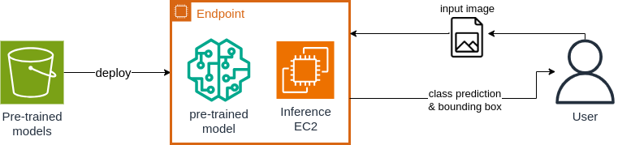

# Overview
Model tensorflow SSD Resnet50 is used to try to detect species of birds.\
The first part is deploy pretrained version of the model to test its initial capability of detecting any bird (no specific species). \
The second part is finetune the model on custom dataset of few bird classes/species to test feasibility of finetuning pretrained models to predict new unseen classes.

## Raw pretrained model
The pretrained model is deployed out of the box. 

## Finetuning
The pretrained model is finetuned for predicting the new birds classes. 

## Final say
This project is a failure. Object detection models can only be optimized to minimize localization error (bonding box positions around objects). Not possible to minimize class prediction error (classification). 
